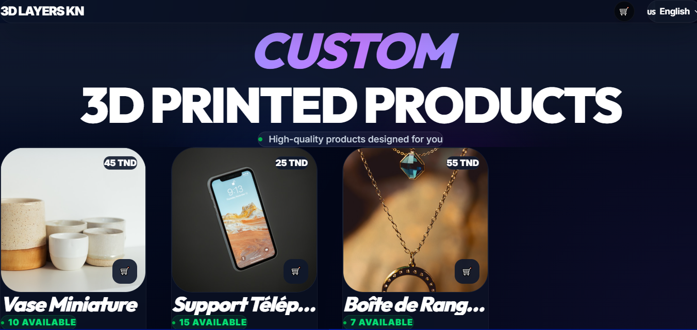
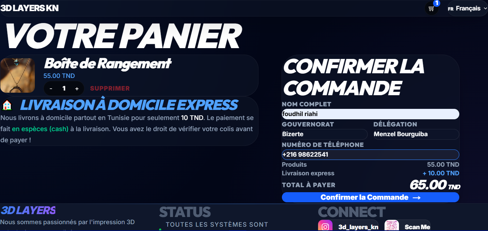
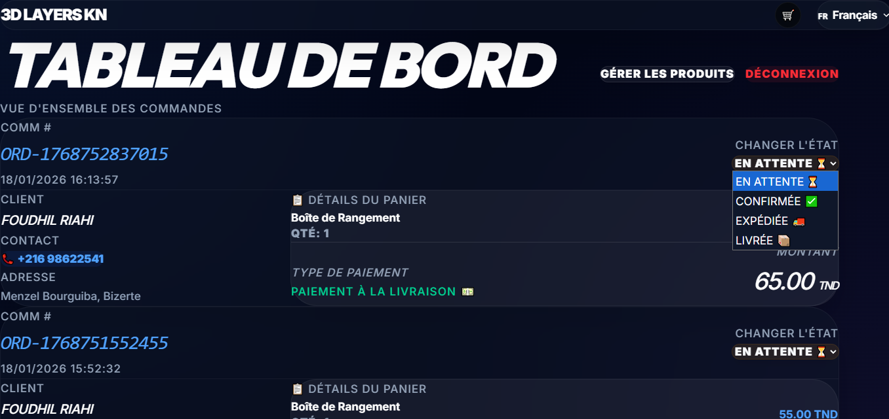
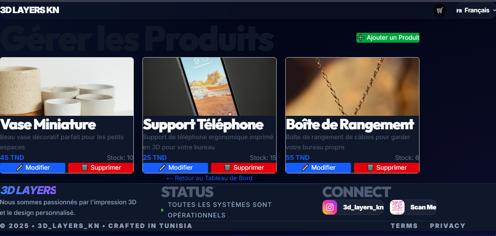

<div align="center">

# 🇹🇳 3D LAYERS KN

[](https://nextjs.org/)
[](https://typescriptlang.org/)
[](https://tailwindcss.com/)
[](https://turso.tech/)

**Modern e-commerce platform for 3D printed products**

*Built with ❤️ in Tunisia*

[🌐 Live Demo](https://3dlayer-kn.netlify.app/) • [Features](#-features) • [Screenshots](#-screenshots) • [Getting Started](#-getting-started)

</div>

---

## ✨ Features

| Feature | Description |
|---------|-------------|
| 🛒 **Smart Cart** | LocalStorage persistence with real-time updates |
| 🌐 **Multi-language** | French, English & Arabic (RTL support) |
| 📱 **Responsive** | Mobile-first design, works on all devices |
| 🔒 **Secure** | Input validation, XSS protection, rate limiting |
| 📧 **Notifications** | Automatic email alerts for new orders |
| 👤 **Admin Panel** | Order management & product CRUD |
| 🗄️ **Serverless DB** | Turso (SQLite) - 9GB free forever |
| ⚡ **Fast** | ISR caching, optimized images, lazy loading |

---

## 📸 Screenshots

<div align="center">

### 🏠 Homepage


### 🛍️ Product Details


### 🛒 Shopping Cart


### 👤 Admin Dashboard


</div>

---

## 🛠️ Tech Stack

```
Frontend     →  Next.js 14 (App Router) + React 18
Styling      →  Tailwind CSS + Custom Glass UI
Database     →  Turso (libSQL/SQLite Edge)
Language     →  TypeScript
Auth         →  Custom Admin Auth
Email        →  Nodemailer + Gmail
Deployment   →  Netlify
```

---

## 🚀 Getting Started

### Prerequisites

- Node.js 18+
- npm or yarn
- [Turso](https://turso.tech) account (free)

### Installation

```bash
# Clone the repository
git clone https://github.com/foudhilriahi/3d-layers-kn.git
cd 3d-layers-kn

# Install dependencies
npm install

# Set up environment variables
cp .env.example .env.local
# Edit .env.local with your credentials

# Run development server
npm run dev
```

### Environment Variables

```env
TURSO_DATABASE_URL=libsql://your-db.turso.io
TURSO_AUTH_TOKEN=your-token
ADMIN_PASSWORD=your-secure-password
EMAIL_USER=your-email@gmail.com
EMAIL_PASSWORD=your-app-password
```

---

## 📦 Deployment

### Netlify (Recommended)

1. Push to GitHub
2. Connect repo on [Netlify](https://app.netlify.com)
3. Configure:
   - **Build command:** `npm run build`
   - **Publish directory:** `.next`
4. Add environment variables
5. Deploy! 🚀

---

## 📁 Project Structure

```
├── app/
│   ├── admin/          # Admin dashboard
│   ├── api/            # API routes
│   ├── cart/           # Shopping cart
│   ├── products/       # Product pages
│   └── page.tsx        # Homepage
├── components/         # React components
├── lib/                # Utilities & DB
│   ├── db.ts           # Turso connection
│   ├── actions.ts      # Server actions
│   └── validation.ts   # Input validation
└── public/             # Static assets
```

---

## 🤝 Contributing

Contributions are welcome! Feel free to open issues or submit PRs.

---

## 📄 License

MIT © [foudhilriahi](https://github.com/foudhilriahi)

---

<div align="center">

**Made with 💙 using Next.js & Turso**

[](https://github.com/foudhilriahi/3d-layers-kn)

</div>
